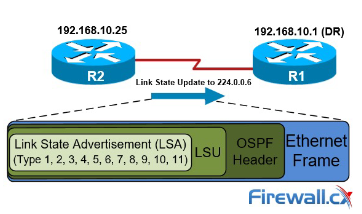
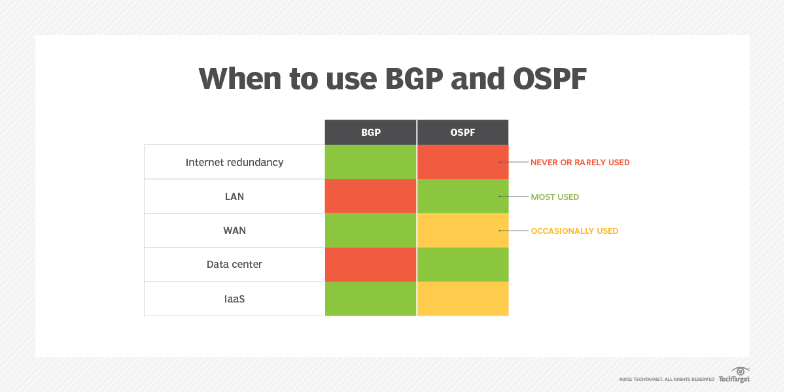

# Routing

-   Each router has its own routing table

-   If routing tables are coherent, packets can go from any node in the network to any node (if not, it can lead to loops and blackholes)

-   Each router can sense if their links are up or down, or if new networks are added

-   Automatically updates routing table

-   Based on some objectives to optimize:
    -   Smallest number of hops
    -   Smallest delay
    -   Largest throughput
    -   Balance load on links
    -   Administrative distance
    -   etc.

### Centralized routing

-   Nodes report link status to central location

-   Central location runs optimization algorithm

-   Returns routing table to each router

-   SDN-like solutions (data centers)

### Distributed routing

-   Updating routing tables dynamically

-   According to information from other nodes
    -   Each router knowns the networks it is directly connected to
    -   Routers send **control packets** to other routers
    -   Geographically dispersed network

### Routing algorithms

-   **Link state**

    -   Full topology of the network, then Disjkstras
    -   **Distributed:** flood link state announcements - OSPF
    -   **Problem:** scaling, since it's taxing on the routers, because each node needs an entire picture of the network

-   **Distance Vector**

    -   Distance to destination node, Bellman-Ford
    -   Each node only knows about their neighbours
    -   Routing by rumor
    -   **Distributed:** updates distances, resends to neighbors

-   **Path Vector:**
    -   List of nodes (ASes) to destination node, local preference
    -   List of nodes to destination node, local preferences
    -   **Advantage:** Prevents routing loops by maintining path information
    -   **Disadvantage:** Complexity in policy management, convergence time
    -   **Distributed:** update path vectors, resends to neighbors

### IGPs and EGPs

- **IGPs** are used **within your organization** (Autonomous Systems) and are typically administred by the same entity.
- **EGPs** are used **between organization** (Autonomous Systems) and are typically within different administrative domains.
    - Each node has a different administrator
    - The internet
    - Each node is an Autonomous System - and a network by itself

-   **Interior Gateway Protocols (IGPs)**

    -   OSPF (link state)
    -   EIGRP (advanced distance vector, hybrid)
    -   RIP (distance vector)
    -   IS-IS (link state)

-   **Exterior Gateway Protocols (EGP)**
    -   BGP (path vector)

## RIP (Routing Information Protocol)

-   An old protocol, comes in v1 or v2
-   Uses hop count as metric

## EIGRP (Enhanced Interior Gateway Protocol)

-   Made by Cisco, Low vendor support
-   Very detailed metric for path selection
-   Easy to work with

## iBGP (Interior Border Gateway Protocol)

-   Very manual configuration
-   Highly tunable
-   Often used in specific cases
-   Difficult to learn and implement

## IS-IS (Intermediate System to Intermediate System)

-   A good robust robust protocol
-   Very good in the backbone of big networks
-   Not very popular
-   A bit harder to learn and use

## OSPF (Open Shortest Path First)

-   Uses Shortest Path First (Dijkstras Algorithm)

-   Router store information about the network in **LSAs (Link State Advertisements)**, which are organized in a structure called the **LSDB (Link State Database)**.

-   Routers will **flood** LSAs until all routers in the OSPF area develop the same map of the network (LSDB).

### OSPF Steps - Basic

-   In OSPF, there are three main steps in the process of sharing LSAs and determining the best route to each destination in the network.

-   **1. Become neighbors:** two routers running OSPF on the same link agree to form a neighbour relationship.

-   **2. Exchange LSDB information:** The neighbour routers swap their LSDB information with each other. Essentially they change LSAs present in their LSDB.

-   **3. Store LSAs in the LSDB** once all of the lsas have been flooded (the goal is to have every router with the same info in their lsdb).

-   **3. Calculate the best routes**: Each router chooses the best routes to add to its routing table based on the learned LSDB information. This is made by running SPF (aka Dijkstras).

### Router ID (RID)

Before becoming neighbirs, each router needs to choose a router ID. A router ID is usually in the form of an IPv4 address, but you can choose it however you want.

-   Router id order of priority:
    -   **1)** Manual configuration
    -   **2)** Highest 'up' status loopback interface IP address
    -   **3)** Highest 'up' status non-loopback interface IP address (aka highest IP addr on the router)

### Hello Packets

A HELLO packet is a special data packet (message) that is sent out periodically from a router to establish and confirm network adjacency relationships to other routers in the Open Shortest Path First (OSPF) communications protocol. On networks capable of broadcast or Multicast transmission, a HELLO packet can be sent from one router to all other routers simultaneously to discover neighboring routes.

OSPF networks are made up of many interconnected routers. These routers are connected on their interfaces. The HELLO packet is the method for routers to announce to each other that they share an interface.

Without the use of a HELLO packet, each router would need to have its connections to other routers manually configured. Once routers successfully exchange HELLO packets, they can automatically establish adjacency and can begin to route data between them.

An hello packet contains the **router ID** and its **already known neighbors**.

After a router receives an hello message, before becoming neighbors, the router runs some very specific checks to check if they can become neighbors:

-   The area ID must be the same
-   The connecting links between the routers must be on the same subnet
-   The hello and dead timers must be the same (the dead timer is how long a router will wait without hearing an hello message, before assuming that router is dead)
-   Authentication and stub area flag must match
-   Routers must use unique router IDs

If all of these pass, router 2 moves to an `init state` and sends an hello message to router 1 with its router ID and router 1 as a known neighbor (this allows router 1 to move to the `2-way state`).

Then router one sends another hello message listing router 2 as a known neighbor, which then allows router 2 to move to the `2-way state` too.

-   Once the exchange process starts, both routers enter the `exstart state`. At this point, the routers select a slave and a master

### DRs and BDRs

If there is no hierarchy, if a link goes down a router announces it to all of its neighbours. Each of their neighbours does the same and quickly this gets out of hand (**doesn't scale properly**).

- For this there is a **DR** and **BDR**.

- The DR and BDR are **elected** based on the **highest OSPF priority**.
    - **Priority** is set to **1 by default**.
    - **If** the **priority ties**, then the **election is based** on the **highest router ID**.
    - When when the same segment, routers will only become full neighbors with DRs and BDRs (the other neighbors will stay in the 2-way state) => **this means every router will ignore updates unless it comes from the DR!**

#### DR (Designated Router)

- **Role:** The DR is a special router elected among OSPF routers on a multi-access network (like Ethernet).
- **Purpose:** It reduces the amount of routing protocol traffic and simplifies the process of sharing routing information.
- **Function:** The DR collects and distribtues OSPF routing information to and from all routers in the network segment. This way, instead of every router talking to every other router (which would be inefficient), all routers talk to the DR

#### BDR (Backup Designated Router)

- **Role:** The BDR serves as a standby to the DR.
- **Purpose:** It ensures continuity and reliability. If the DR fails, the BDR takes over its duties without the need for a new election process.
- **Function:** The BDR listens to the OSPF traffic just like the DR and is ready ot become the DR if the current DR fails.

### OSPF states

Let's assume there are 2 routers (router 1 and router 2). Router 1 sends an hello packet to router 2 with its router ID and a list of its already known neighbors. Router 2 runs some checks in order to see if they can become neighbors and, if these checks pass, router 2 sends another hello packet to router 1 with its router id and the list of its neighbors (with router 1 in it). This makes router 1 enter a `2-way state`. After this, router 1 sends another hello message to router 2 listing it as a known neihgbor and router 2 can enter this `2-way state` too.

Once the exchange process starts, both router enter the `exstart state`. At this point, the routers select a slave and a master (based on the router ID). The master will constrol the sequence numbers and start the exchange process (with both routers being on the `exchange state`).

While on the `exchange state`, both routers send a list of their LSAs (this is called a database description aka **DBD**).

After this they go to a `loading state`, where each router will look at the DBD and request any information it doesn't have. This happens to prevent loops, by asking for information rather than just firing out updates.

The request the router makes when he sees a LSA it doesn't have on the DBD is called a **Link State Request (LSR)**. When the other router respondes, it sends a **Link State Update (LSU)**. When the router receives the LSU it sends an **LSAck**. When the exchange of information has happened both routers enter the `full neighbor state`.

`Note:` This example is of a Point-to-Point network. On a broadcast network, routers will only form a full neighbor relationship with DRs and BDRs.

### Cost Calculation

-   OSPF calculates the best routes by using a **metric** called **cost**.

-   **Cost:** Value given to a link based on the bandwidth of that interface.
    -   Cost = Reference bandwidth / Interface bandwidth

| Interface    | Default Bandwidth | Cost |
| ------------ | ----------------- | ---- |
| Serial       | 1,544 Kbps        | 64   |
| Ethernet     | 10,000 Kbps       | 10   |
| FastEthernet | 100,000 Kbps      | 1    |

### OSPF Areas

-   OSPF uses **areas** to **divide up the network**

-   An **area** is a **set of routers and links that share the same LSDB**.

-   Small networks can be singe-area without any negative effects on performance.

-   In larger networks, a single-area design can have negative effects:

    -   the SPF algorithm takes more time to calculate routes.
    -   the SPF algorithm requires exponentially more processing power on the routes.
    -   the larger LSDB takes up more memory on the routers.
    -   any small change in the network causes every router to flood LSAs and run the SPF algorithm again.

-   By dividing a large OSPF network into several smaller areas, you can avoid the above negative effects.

#### Concepts

-   **Area:** set of routers and links that share the same LSDB.

-   **Backbone Area (area 0):** area that all other areas must connect to.

-   **Internal Routers:** outers with all interfaces in the same area.

-   **Area Border Routers (ABRs):** routers with interfaces in multiple areas.

    -   ABRs maintain a separate LSDB for each area they are connected to. It is recommended that you connect an ABR to a maximum of 2 areas. Connecting an ABR to 3+ areas can overburden the router.

-   **Backbone Routers:** routers connected to the backbone area (area 0).

-   **Intra-area route:** route to a destination inside the same OSPF area.

-   **Inter-area route:** route to a destination in a different OSPF area.

-   **Autonomous System Boundary Router (ASBR):** OSPF router that connects the OSPF network to an external network

#### Rules

-   OSPF **areas should be contiguous** (each individual area should be connected, and not divided).

    -   if there are non-contiguous areas, they should be made into a different area.

-   **All** OSPF **areas** **must have** at least **one ABR connected to the backbone area**.

-   OSPF **interfaces in the same subnet** **must be in** the **same area**.

    -   if they are not, they won't become OSPF neighbors and won't excahnge information about the networks they know about.

-   OSPF sends hello messages to tell other routers about itself

-   The **passive-interface** command tells the router to stop sending OSPF "hello" messages out of the interface.

-   However, the route will continue to send LSAs informing its neighbors about the subnet condigured on the interface.

-   Single-area OSPF can use any area number (not only 0), although it is not a common practice.

## BGP
- BGP is a standardized exterior gateway protocol designed to exchange routing and reachability information among autonomous systems (AS's) on the Internet. BGP is classified as a Path-Vector routing protocol and it makes routing decisions based on paths, network policies or rule-sets configured by a network administrator.
    - BGP used for routing within an AS is called IBGP (Interior Border Gateway Protocol). In contrast the Internet application of the protocol is called EBGP 

Border Gateway Protocol (BGP) is a set of rules that determine the best network routes for data transmission on the internet. The internet consists of thousands of private, public, corporate, and government networks linked together through standardized protocols, devices, and communication technologies. When you browse the internet, data travels across multiple networks before reaching its destination. BGP's responsibility is to look at all the available paths that data could travel and select the best route. For instance, when a user in the United States loads an application with origin servers in Europe, BGP makes that communication quick and efficient.

BGP makes the internet work through data routing BGP routing is critical because, at its core, the internet is made of hundreds of thousands of autonomous systems.

An **Autonomous System** is a smaller network under the control of a single administrative entity. You can uniquel identify such networks by their autonomous system number assigned by IANA. Data travels between AS's as it moves from source to destination.

### Find the best route

As data travels across the Internet from source to destination, every autonomous system in between has to decide where the data packet should go next.

The decision is based on several factors like **geographical location**, **network congestion** and **data transfer cost**. BGP routing considers these factors and helps determine the next best AS so that data travels on the shortest route from source to destination.

### Discover network connection changes

The structure of the internet is dynamic. New autonomous systems are being added, and old ones removed constantly. Every AS must stay updated with information regarding new and obsolete routes. BGP helps systems to discover and remain updated on such network changes.

### Administer network policies

BGP has the flexibility to allow AS administrators to implement their own routing policies.

For example, you can configure a router running BGP to distinguish between routes that are internal and external to the AS. The administrator can set rules to determine whether data should be routed internally or externally.

### Add a layer of security

BGP supports security in your network management. For example, BGP can authenticate messages between routers using preconfigured passwords. Administrators can verify BGP messages that come from legitimate AS's and filter out unauthorized traffic.

### How does BGP work?

BGP works using a mechanism called peering. Administrators assign certain routers as BGP peer or BGP speaker routers. You can think of peers as devices on the edge of boundary of an AS. BGP peers can perform the following functions:

#### Route Discovery:

BGP peers exchange routing information with neigboring BGP peers through network-layer reachability information (NLRi) and path attributes. NLRi includes connectivity information about neighbors. Path attributes include information like latency, hop count, and cost of transmission.

After they exchange information, each BGP peer can then construct a graph of network connections around it.

#### Route Storage:

During the discovery process, every BGP router collects route advertisement information and stores it in the form of routing tables. It uses the routing table for path selection and also updates it frequently.

For instance, the BGP router receives keep-alive messages every 30 seconds from neighboring routers. It updates the stored routes accordingly.

#### Path selection

BGP routers use the stored information to route traffic optimally. The primary factor in path selection is the shortest path, as determined by the stored route graphs. When a destination is reachable from multiple paths, BGP selects the best one by sequentially evaluating other path attributes.

## Others

### BGP - Transit and Peering

- **Transit:** carrying traffic across a network
    - (commercially: for a fee)
    - e.g. the end-users of an ISP are transit customer: they pay a fee to the ISP

- **Peering:** exchanging routing information and traffic
    - (commercially: between similar sized networks, and for no fee)

- **Default:** where to send traffic when there is no explicit match in the routing table

### Internet Tiers

- **Tier 1**
    - Settlement-free peering only

- **Tier 2**
    - Some free, other paying

- **Tier 3**
    - Paying only peering

### When to use BGP or OSPF?

