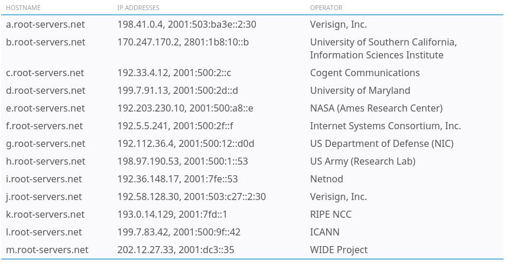
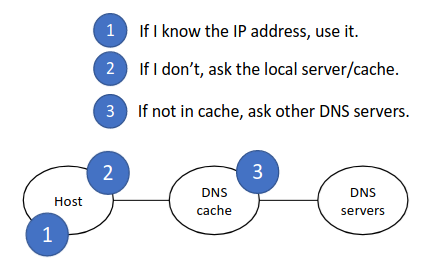
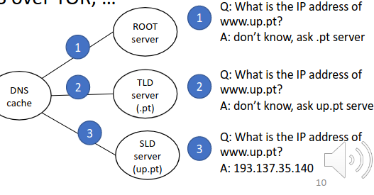
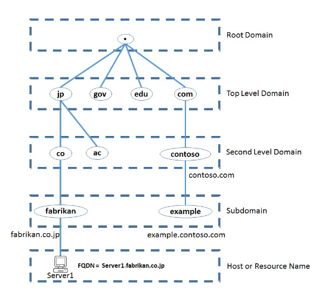

# Domain Name System

- DNS is used to resolve human-readable names (google.com) to IP addresses
    - e.g. when you type 'youtube.com' into a web browser, your device will ask a DNS server for the IP address of youtube.com

- The DNS server(s) your device uses can be manually configured or learned via DHCP (Dynamic Host Configuration Protocol).

- Standard DNS queries/responses typically use UDP.
    - TCP is used for DNS messages greater than **512 bytes**.

- DNS standard port is **port 53**.

- The Domain Name System delegates the responsibility of assigning domain names and mapping those names to Internet resources by designating authoritative name servers for each domain.


## DNS Query Flow

Internet Browser (yahoo.com) > DNS Resolver (checks cache, empty) > Root Server (redirects to .com tld ) > TLD (redirects to yahoo.com ans) > Authoratative Name Server (knows the ip)

Authorative Name Server (x.x.x.x) > DNS Resolver (receives x.x.x.x and stores it in cache) > Internet Browser (x.x.x.x)

**Root Server:**
- A DNS zone is a portion of the DNS namespace that is managed by a specific organization or administrator
- The DNS root zone contains all domain names
- The top or the root of the DNS Hierarchy
- 13 sets of these root servers strategically placed around the world
- Operated by 12 different organizations
- The root server doesn't know what the ip of a name is, but it knows to what TLD (Top-Level-Domain) to which it should forward to



**Top Level Domain Server:**
- Stores the address information for the top level domain (.com, .net, .org, etc.)

* Authoritative Name Server:**
- Responsible for knowing everything about the domain
    - Including the ip address

- **Non-Root Authoritative Name Servers**
    - **Top Level Domains**
        - .com, .net, .org, etc.
    - **Second-level Domains**
        - Each TLD has a TLD manager organization, responsible for assigning SLDs under that TLD
        - The same happens down the hierarchy until the final host or resource name
    - **Masters**
        - Stores the definitive versions of all records
        - Identified in start-of-authority (SOA) resource record
    - **Slaves**
        - Automatic updating mechanism to maintain an identical copy of the primary server's database for a zone




- **Local**
    - /etc/hosts, resolv.conf, DHCP

- **DNS Request and reply messages**
    - QR, AA, NAME, TYPE
    - TCP/UDP port 53

- **Servers**
    - Local/Remote DNS server/cache/resolver
    - Root name server, TLD, SLD
    - Caching
    - Split Server

## DNS Message Formats


## DNS name Hierarchy

- Root Domain
- Top Level Domain
- Second Level Domain
- Subdomains (possibly)



## DNS Records

- 'A' records are used to map names to IPv4 Addresses
    - A youtube.com A 172.217.25.110
- 'AAAA' records are used to map names to IPv6 Addresses
    - AAAA youtube.com AAAA 2404:6800:4004:819:200e
- 'CNAME' (canonical name) is used to map a name to another name

## DNS Cache

Devices will save the DNS server's responses to a local DNS cache. This means they don't have to query the server every single time they want to access a particular destination.

### DNS in Cisco IOS

- For hosts in a netork to use DNS, you don't need to configure DNS on the routers. They will simply forward the DNS messages like any other packets.
    - However a Cisco router can be configured as a DNS server, although it's rare.
    - If an internal DNS server is used, usually it's a Windows or Linux server.

- A Cisco router can also be configured as a DNS client.

```
//configures 31 to act as a DNS server
R1(config) # ip dns server      

// Configure a list of hostname/IP address mappings
R1(config) # ip host R1 192.168.0.1
R1(config) # ip host PC1 192.168.0.101
R1(config) # ip host PC2 192.168.0.102
R1(config) # ip host PC3 192.168.0.102

// configure a DNS server that R1 will query if the requested record isn't on the host table
R1(config) # ip name-server 8.8.8.8

// Rnable R1 to perform DNS queries (enabled by default)
R1(config) # ip domain lookup

R1(config) # show hosts // view configured hosts
```

Coinfigure router to act as a client (but not server)

```
// configure a DNS server that R1 will query if the requested record isn't on the host table
R1(config) # ip name-server 8.8.8.8

// Rnable R1 to perform DNS queries (enabled by default)
R1(config) # ip domain lookup

// (optional) Configure the default domain
R1(config) # ip domain name gui1612.com
```