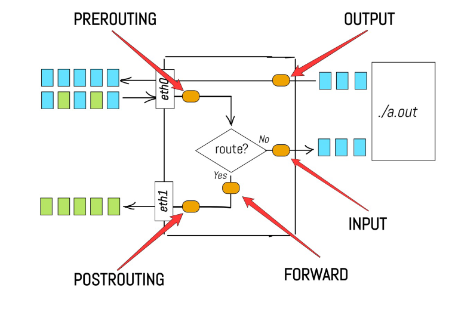

# Python Automation

## Linux Routing and IPTables

## Python Programming for Network Automation

- Network source of truth
- Typical provisioning steps
    - Prepare configurations
    - Define management access to target devices
    - Push commands
- Templates

## Network Source of Truth

- Reference of network assets and intended configurations
    - Used as input for configurations etc.

- Doing things manually is ok fpr small deployments (e.g. hardcoding ips and interfaces)

## Others

### Prepare configurations

- Define function that sets ip address on interface
- Host Interfaces
- Router Interfaces
- Make a sanity check (can be a print)

- Push commands via ssh
    - Use netmiko for example 

### Templates

- Large configuration files with only a few parameters
- template + parameter db => cofig for each device
- Deploy config file