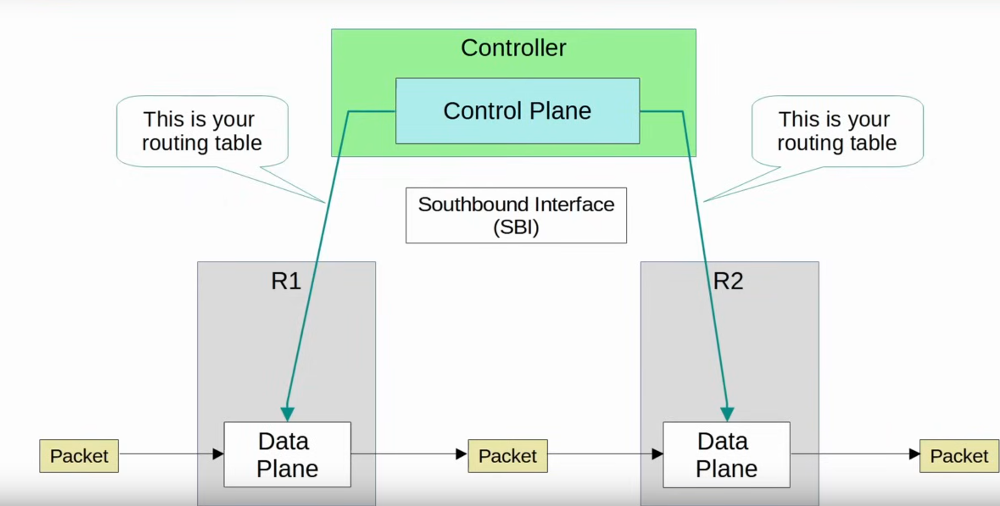
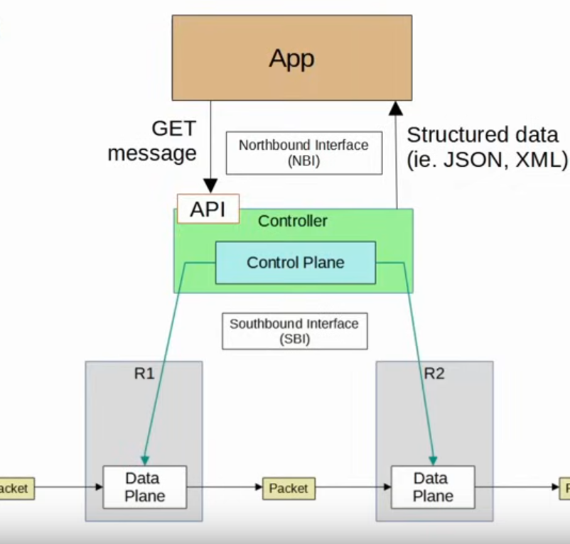

# SDN

## Features of SDN

- **Hardware abstraction**
    - Control works on any hardware that implements API

- **Programmable**
    - Hardware/software bundles only allow configuration of existing control algorithms
    - SND allows us to develop our own algorithms

- **Centralized control of policies**
    - Security policies "nodes of type X can only talk with nodes of type Y"
    - Routing policies "route guest traffic through the firewall"
    - Quality of service policies "prioritize voice traffic"

## Software-Defined Networking

- SDN is an approach to networking that centralizes the control plane into an application called a controller.
    - Wireless LAN Controllers (WLC) are a good example of this

- SDN can be also called **Software-Defined Architecture (SDA)** or **Controller-Based Networking**

- Traditional control planes use a distributed architecture.
    - e.g. each router in the network runs OSPF and the routers share routing information and then calculate their preferred routes to each destination

- An **SDN** controller **centralizes** **control plane functions** like calculating routes.

- The controller can interact programatically with the network devices using APIs

## Southbound Interfaces (SBI)

- The SBI is used for communications between the controller and the network devices it controls.
    - In the diagram R1 and R2 are controlled by the controller and the SBI is used to communicate between them.

- The SBI typically consists of a communication protocol and API.
    - Data is exchanged between the controller and the network devices.
    - An API on the network devices allows the controller to access information on the decicesm ctonrol their data plane tables, etc.

- Examples of SBIs:
    - OpenFlow
    - Cisco OpFlex
    - Cisco onePK
    - NETCONF

## Northbound Interfaces (NFI)

==REVIEW==

- Using the SBI, the controller communicates with the managed devices and gathers information about them.
    - The devices in the network
    - The topology (how the devices are connected together)
    - The available interfaces on each device
    - Their configurations (ip addresses, etc.)

\=========

- The **Northbound Interface (NBI)** is what allows us to interact with the controller, access the data it gathers about the network, program it, and make changes in the network via the SBI.

- A REST API is used on the controller as an interface to interact with it

- Data is sent in a structured (serialized) format such as JSON or XML.
    - This makes it much easier for programs to use the data

## Automation in Traditional Networks vs SDN

- networking tasks can be automated in traditional networks:
    - scripts can be writen (e.g. python) to push commands to many devices at once
    - python + regez

- However, the **roubust** and **centralized** data collection by SDN controllers greatly facilitates these functions.
    - The controller collects information about all devices in the network.
    - Northbound APIs allow apps to access information in a format that is easy for programs to understand (e.g. JSON, XML)
    - The centralized data facilitates network-wide analytics

- SDN tools can provide the benefits of automation without the requirement of 3rd-party scripts & apps.
    - You don't need expertise in automation to make use of SDN tools.
    - However, APIs allow 3rd-party apps to interact with the controller, which can be very powerful.

Although **SDN and automation aren't the same thing**, the SDN architecture greatly facilitates the automation of various tasks in the network via the SDN controller and APIs.