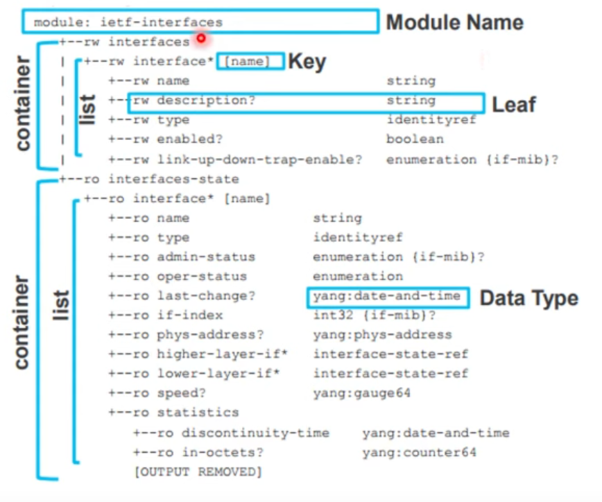
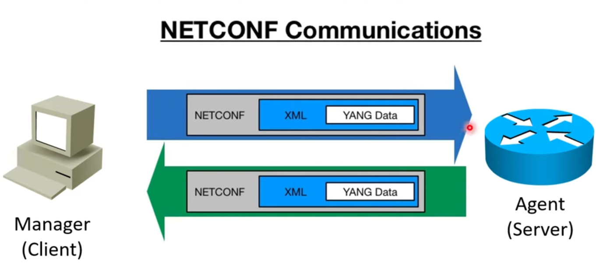
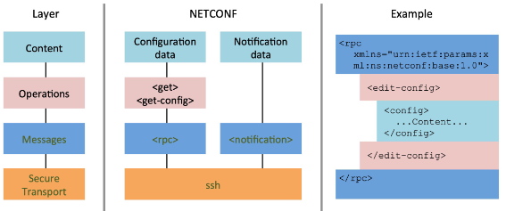
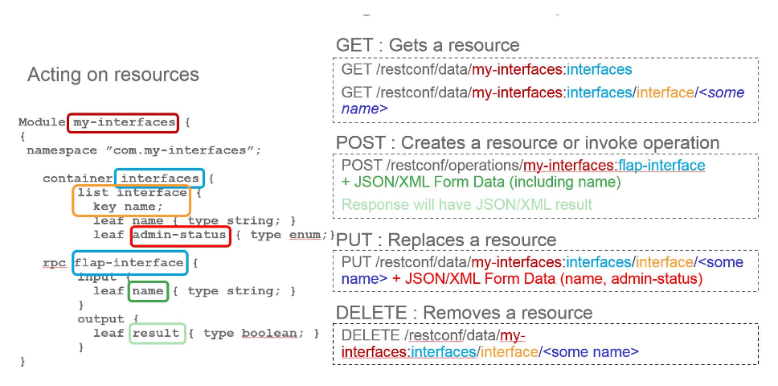
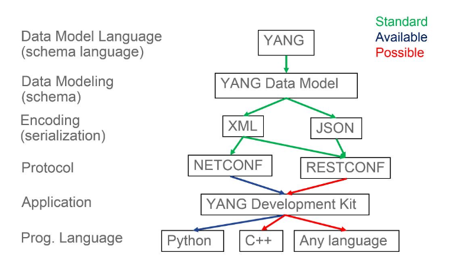

# Device API and Automation Tools

- A **data model** is a well understood and agreed upon method to describe something (can be described using UML, for example).

## YANG (Yet Another Next Generation)

- YANG (IETF, 2010) is a data modellin language which provides a standardized way to represent the operational and configuration data of a network device.

- It can be used both internally and when packaged for transmission
    - Using remote devices
    - Interacting with network devices
    - Pull and push information from devices

- Building blocks:
    - **module** - top of the hierarchy of nodes
    - **containers** - related nodes
    - **list** - identified nodes
    - **leaf** - individual attributes of a node
    - **type** - every leaf has an associated type

## Network Management Transport

- The configuration and opertaional status of a network device's components and services can be remotely read and written to.

- NETCONF, RESTCONF and gRPC are APIs which describe the protocols and methods for transport of network management data.

## NETCONF

- NETCONF was designed as replacement for SNMP
    - SNMP issues were security concerns, if it was before version 3 and SNMP is good for reading, not from writing information to the devices

- NETCONF and YANG provide a standardized way to programatically inspect and modify the configuration of a network device.

- **YANG** (IETF, 2010) is a **data modelling language** which provides a standardized way to represent the operational and configuration data of a network device.

- **NETCONF** (IETF,2006) is the **protocol** that **remotely reads or applies changes to the data on the device**.

- **XML** encoding is used.

- The transport is over **SSH or TLS**.

---

- **Content** - the data to be inspected or changed

- **Operations** - e.g. <get-config>, <edit-config>. Initiated via RPC using XML encoding.

- **Messages** - Remote Procedure Calls (RPC allows one system to request another system to execute code)

- **Transport** - between client and server. Supports SSH or TLS.

## RESTCONF

- RESTCONF (standardized in 2017) builds on NETCONF

- It is an IETF draft that describes how to map a YANG specification to a RESTful interface

- Uses HTTP verbs over a REST API

- RESTCONF is not intended to replace NETCONF, but it is easier to use

- XML or JSON encoding is used

- The transport is HTTP(S)

# Overview

## Automation tools

- Ansible, Salt, Puppet, Chef

### Ansible

- Ansible is an open source, command-line IT automation software application written in Python. It can configure systems, deploy software, and orchestrate advanced workflows to support application deployment, system updates, and more.

- Ansible’s main strengths are simplicity and ease of use. It also has a strong focus on security and reliability, featuring minimal moving parts. It uses OpenSSH for transport (with other transports and pull modes as alternatives), and uses a human-readable language that is designed for getting started quickly without a lot of training.

## Others

#### How are NETCONF and YANG related?

NETCONF and YANG are closely related in network management, with NETCONF serving as the protocol for configuring and managing network devices and YANG providing the data models that define the structure and semantics of the configuration and state data handled by NETCONF.

YANG models describe the precise data formats and constraint, enabling NETCONF to interpret and manipulate the configuration data consistently across different devices, This relationship ensures standardized interoperable management of network configurations, leveraging NETCONF's operational capabilities and YANG detailed data model.