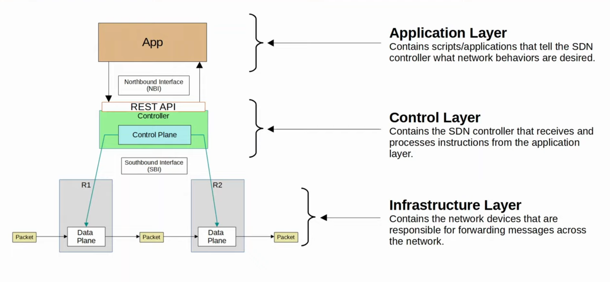

# Network Function Virtualization

## NFV vs VNF vs etc

- **Network function virtualization** - the concept
- **Virtual Network Function (VNF)** - the network function that is being virtualized
- **SDN** - not really related
- **Network Virtualization** -  can be enabled with SDN or with VLANs, tec.

NFV is a network architecture concept that leverages IT virtualization technologies to vietualize entire classes of network node functions into building blocks that may connect or chain together to create and deliver communication services.

NFV relies upon traditional server-virtualization techniques such as those used in enterprise IT. A virtualized network function, or VNF, is implemented within one or more virtual machines or containers running different software and processes, on top of commercial off the shelf high-volume servers, switches and storage devices, or even cloud computing infrastructure, instead of having custom hardware appliances for each network function thereby avoiding vendor lock-in.

Examples of NFV include virtualized load balancers, firewalls, intrusion detection devices and WAN accelerators to name a few.

The decoupling of the network function software from the customized hardware platform realizes a flexible network architecture that enables agile network management, fast new service roll outs with significant reduction in CAPEX and OPEX.

### SDN Review

- SDN is an approach to networking that centralizes the control plane into an application called a controller.

- Traditional control planes use a distributed architecture.

- An SDN controller centralizes control plane functions like calculating routes.
    - Network devices no longer use OSPF to share information with eachother. Instead they share information with the controller, which takes that information and calculates routes for the entire network.

- Depending on the SDN solution the entire control plane or just a part might be centralized in the controller, leaving some functions for the network devices.

- The controller can interact programmatically with the network devices using apis.
    - The **SBI** is used for communications between the controller and the network devices it controls.
    - The **NBI** is what allows us to interact with the controller with our scripts and applications.

#### SDN Architecture 

- **Application Layer**
    - Contains scripts/applications that tell the SDN controller what network behaviours are desired.

- **Control Layer**
    - Contains the SDN controller that receives and processes instructions from the application layer.

- **Infrastructure Layer**
    - Contains the network devices that are responsible for forwarding messages across the network.

#### Example: SD-Acess

- Cisco **SD-Access** is Cisco's SDN solution for automating campus LANs.
    - ACI (Application centric Infrastructure) is their SDN solution for automating data center networks.
    - SD-WAN is their SDN solution for automating WANs
    - SD-LAN is their SDN solution for automating LANs

- Cisco DNA (Digital Network ARchitecture) Center is the controller at the center of SD-Acess